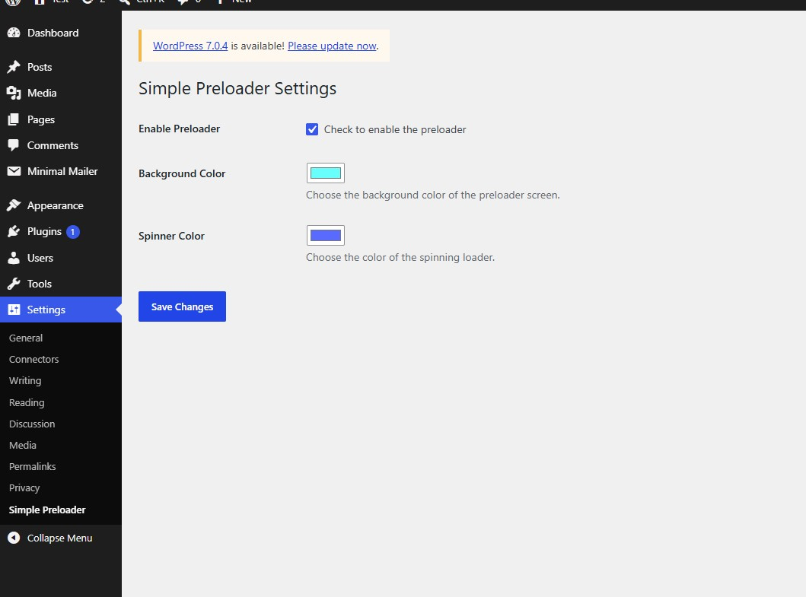

# Simple Lightweight Preloader — Fast & Custom WordPress Preloader

A stable, lightning-fast, and highly customizable page preloader built with **Core PHP**, **Vanilla JavaScript**, and **Inline CSS**. It supports native WordPress settings integration, accessibility standards, and strict memory optimization for a seamless user experience.

---

## 🚀 Features

* **Zero External Dependencies:** No jQuery or heavy external libraries required. Injects optimized CSS and JavaScript directly into the DOM to eliminate extra HTTP requests and maximize page speed.
* **Fully Customizable UI:** Easily adapt the preloader to your brand identity. Change the background color and spinner ring color directly from a clean WordPress admin settings page.
* **Accessibility Ready:** Built-in support for the `prefers-reduced-motion` CSS media query, ensuring users who prefer less animation see a static, comfortable loading screen.
* **Memory Optimized:** Automatically hides and removes the preloader node from the DOM once the page load transition completes, actively freeing up browser memory.

---

## 📸 Interface Screenshots

| Admin Settings Panel | Frontend Preloader Demo |
| :---: | :---: |
|  |  |


---

## 📁 Project Directory Structure

```text
/simple-lightweight-preloader
│── simple-preloader.php    # Main plugin file, core PHP class & logic
│── readme.txt              # WordPress repository documentation
│── LICENSE                 # MIT License file

```

---

## 🛠️ Tech Stack

* **Backend:** Core PHP, WordPress Plugin API (Settings API, Hooks)
* **Frontend:** Vanilla JavaScript (ES5/ES6 compatible), CSS3 animations
* **Design:** Native WordPress Admin UI formatting

---

## ⚙️ Installation & Setup

1. **Download or Clone the repository:**
Download the plugin files and compress them into a `.zip` archive, or clone directly into your WordPress plugins folder.
```bash
cd wp-content/plugins/
git clone https://github.com/amanullahykhan/simple-lightweight-preloader.git

```


2. **Activate the Plugin:**
* Log into your WordPress Admin Dashboard.
* Navigate to **Plugins > Installed Plugins**.
* Find **Simple Lightweight Preloader** and click **Activate**.


3. **Configure Settings:**
* Navigate to **Settings > Simple Preloader**.
* Check "Enable Preloader".
* Select your preferred Background and Spinner colors.
* Click **Save Changes**.


---

## 👤 Author & Developer

* **Amanullah Khan**
* **Role:** Developer & Maintainer, Web Development, Front-End Engineering & Social Media Management
* **Location:** Pakistan
* **GitHub:** [GitHub Profile](https://github.com/amanullahykhan)
* **HuggingFace:** [HF Profile](https://huggingface.co/ak32khan)
* **LinkedIn:** [LinkedIn](https://www.linkedin.com/in/amanullahykhan/)
* **Support:** [☕ Buy Me a Coffee](https://amanullahykhan.gumroad.com/l/niekk)

---

## 📄 License

This project is open-source and available under the [MIT License](https://opensource.org/licenses/MIT).
